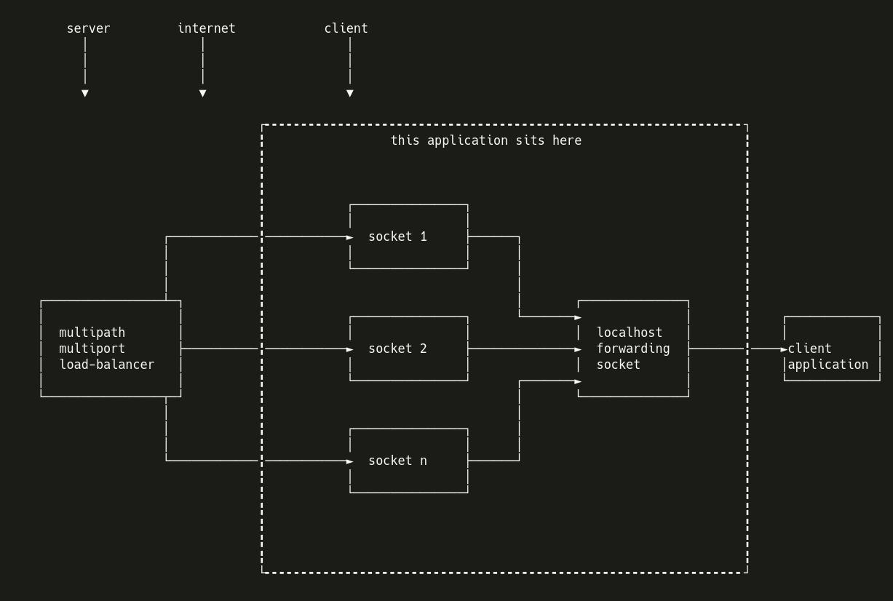

# port forwarding Multi-Input-Single-Output

forward several ports into a single one 


this tool forwards packets from several ports into one single port.

# how it works:
it stays on client side before client application and forwards all packets from multiple ports into one single localhost port.  
the application that wants to receive data listens to the dedicated port on localhost.

## block diagram



_ascii block diagram drawn using asciiflow.com_

## usage

__Note__: this app is under development. it somehow works but make sure to come back for newer versions.

to use this app, you first need to start the server app which is listening to a port. let's say you have a server on port 4000

then run `main.py` with args server_port and host_ports in order.

now you can forward any number of localhost ports into port 4000. let's say you want to forward ports 8000, 8001 and 8002. you do it by running this app like this:

```bash
$ python3 main.py 4000 8000 8001 8002 8003
```

this will forward three ports 8000, 8001 and 8002 into one single port 4000.

each response from port 4000 will be sent to one of the host ports randomly. (8000, 8001, 8002)

## todo

- server## todo

- server must be running and listening before running this app. find a solution to fix this limitation.
- write a better CLI
- write more docs